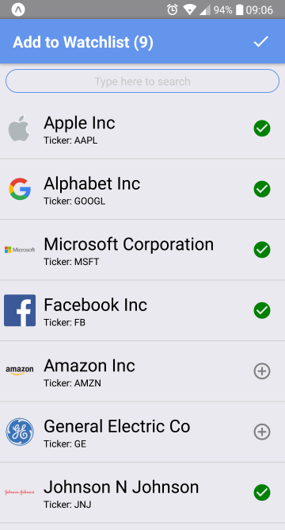
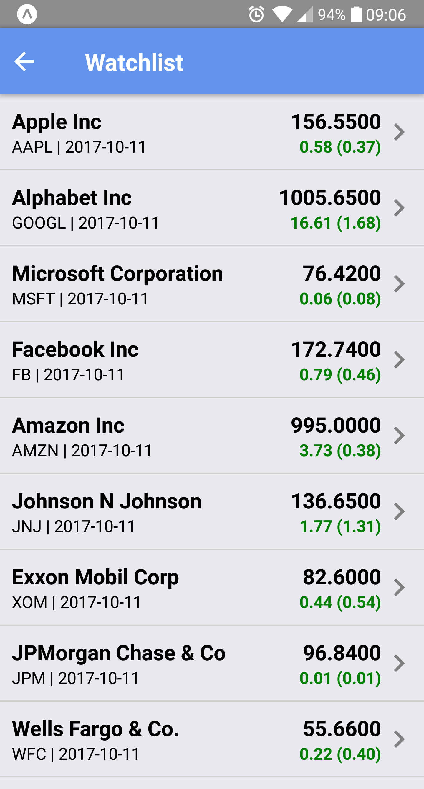
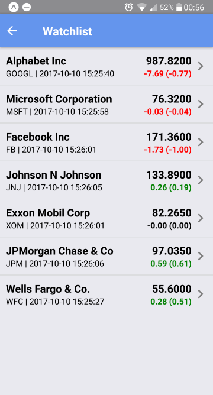

# React Native Stock Watchlist
Simple stock watchlist app developed using React Native. 95%+ cross platform code.

It uses following components: 
1. Redux for state management
2. React navigation (with hardware back for Android)
3. Victory Charts 
4. React Native Vector Icons 
5. React Native FlatList

## Android screenshots

 "Watchlist")
 
 "Another Watchlist")

This project was bootstrapped with [Create React Native App] to allow new users to get started off quickly. (https://github.com/react-community/create-react-native-app).
